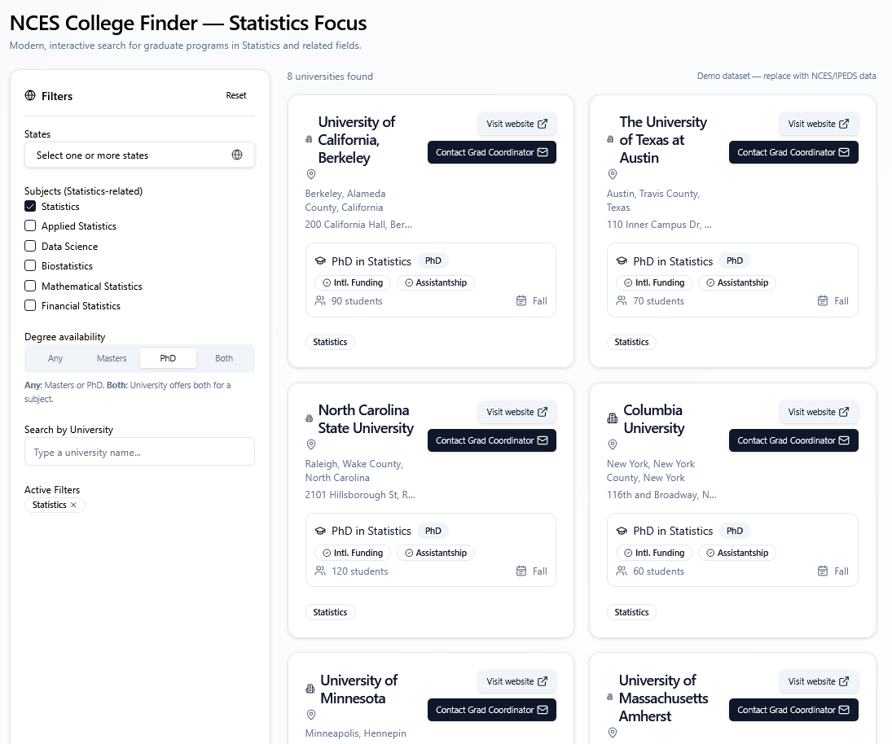

# NCES College Finder — Statistics-Focused (Modern React/Next.js)

A modern, interactive web app to explore graduate programs (Masters/PhD) in **Statistics and related fields** (Applied Statistics, Data Science, Biostatistics, etc.). Filter by **multiple states**, toggle **subjects**, and view beautiful **university cards** with program details, sessions, student counts, funding flags, and quick **links to websites** or **contact grad coordinators**.

> Demo data is mocked in-code for now. You can later wire to NCES/IPEDS or your own dataset.

---

## ✨ Features

* **Sidebar filters**

  * Multi-select **States**
  * Checkbox **Subjects** (Statistics, Applied Statistics, Data Science, Biostatistics, …)
  * Degree mode: **Any / Masters / PhD / Both** (Both = MS + PhD offered for a subject)
  * Search by University name
* **Responsive results**

  * Clean, modern **cards** (rounded, full-height, buttons inside)
  * Info: programs, sessions (Fall/Spring/Summer), # students, location, address
  * Badges for **Intl. Funding** and **Assistantships**
  * **Visit website** + **Contact Grad Coordinator** buttons
* **Sleek UI**

  * TailwindCSS + shadcn/ui components
  * framer-motion micro-animations
  * lucide-react icons

---

## 🧰 Tech Stack

* **Next.js 15 (App Router)**
* **React 18**
* **TypeScript**
* **TailwindCSS**
* **shadcn/ui**
* **framer-motion**
* **lucide-react**

---

## 📁 Project Structure

```
src/
  app/
    page.tsx            # Main app component (Client Component)
    globals.css         # Tailwind styles
  components/
    ui/                 # shadcn/ui components (generated by CLI)
      button.tsx
      card.tsx
      ...etc
```

---

## 🚀 Quick Start (Local)

> **Windows tip:** run each command on a single line (no backslashes).

```bash
# 1) Create the app
npx create-next-app@latest nces-finder --typescript --eslint --tailwind --src-dir --app
cd nces-finder

# 2) Install shadcn/ui and generate components
npx shadcn@latest init --path src/components --yes
npx shadcn@latest add card button badge checkbox input label separator popover command scroll-area tabs

# 3) Peer deps
npm i framer-motion lucide-react class-variance-authority tailwind-merge

# 4) Ensure path alias in tsconfig.json:
#   "compilerOptions": { "baseUrl": ".", "paths": { "@/*": ["./src/*"] } }

# 5) Make page a Client Component:
#   Add this as the FIRST line in src/app/page.tsx:
#   "use client";

# 6) Start dev server
npm run dev
```

Open [http://localhost:3000](http://localhost:3000)

---

## 🧭 Usage

* Use the **States** popover to select one or more states.
* Tick **Subjects** to narrow to Statistics-related programs.
* Switch **Degree availability** tabs (Any / Masters / PhD / Both).
* Type a **university name** in search to filter cards.
* Click **Visit website** or **Contact Grad Coordinator** on each card.

---

## 🛠️ Development Scripts

```bash
npm run dev       # start dev server
npm run build     # production build
npm start         # run production build locally
npm run lint      # lint with ESLint
```

**Stop the dev server:** press `Ctrl + C` in the terminal (confirm if prompted).
If the port is stuck: `npx kill-port 3000` (Windows: or find PID via `netstat -ano | findstr :3000` then `taskkill /PID <PID> /F`).

---

## 🌐 Deploy (Vercel)

1. Initialize git and push to GitHub:

   ```bash
   git init
   git add -A
   git commit -m "Initial commit"
   git branch -M main
   git remote add origin https://github.com/<your-username>/nces-finder.git
   git push -u origin main
   ```

2. Go to **vercel.com** → **New Project** → import your repo → Framework: **Next.js** → **Deploy**.

> If Vercel fails on ESLint (`no-explicit-any`), fix any lingering `any` types. Example fix used here:
>
> ```tsx
> type SvgProps = React.SVGProps<SVGSVGElement>;
> const CalendarRange: React.FC<SvgProps> = (props) => (/* ... */);
> ```

---

## 🧩 Data Model (current mock)

Inside `src/app/page.tsx`:

```ts
type DegreeType = "Masters" | "PhD";
type Program = {
  subject: string;
  degreeType: DegreeType;
  degreeName: string;
  sessions: string[];           // ["Fall","Spring","Summer"]
  students: number;             // enrollment count
  fundingInternational: boolean;
  assistantship: boolean;
};

type University = {
  id: string;
  name: string;
  website: string;
  location: { city: string; county: string; state: string };
  address: string;
  gradCoordinatorEmail: string;
  programs: Program[];
};
```

---

## 🔌 Connecting Real Data

When ready to replace mock data:

* **Static JSON:** host a JSON file (public/ or remote) and fetch it in a Client Component or use Next Route Handlers for server fetch.
* **Serverless/API:** create an `/api/programs` route and call NCES/IPEDS or your curated source, transform to the model above.
* Add **sorting**, **pagination**, and **URL-based filters** (query params) as needed.

---

## 🧪 Common Gotchas

* **Hooks error (“useState only works in a Client Component”)**
  Add `"use client"` as the **first line** of `src/app/page.tsx`.

* **shadcn components not found**
  Ensure you ran:

  ```
  npx shadcn@latest init --path src/components --yes
  npx shadcn@latest add card button badge checkbox input label separator popover command scroll-area tabs
  ```

  Confirm files exist under `src/components/ui` and your `tsconfig.json` has the `@/*` alias.

* **Windows line continuation**
  Don’t use `\` to break commands—run them on a single line.

* **Port already in use**
  `npx kill-port 3000` or start on another port: `npm run dev -- -p 3001`.

---

## 🗺️ Roadmap

* Sort & filter enhancements (e.g., funding first, PhD availability, students desc)
* Export current results (CSV/Excel)
* Persist filters in URL (`?states=CA,TX&subjects=Statistics&mode=both`)
* Favorites (localStorage)
* Real data integration (NCES/IPEDS or curated)
* Accessibility polish & unit tests

---

## 🤝 Contributing

PRs welcome! Please:

* Use TypeScript
* Keep UI consistent with shadcn styles
* Add small, focused commits
* Run `npm run lint` before pushing

---

## 📜 License

MIT © 2025 rana2hin

---

## 🖼️ Screenshot


---

If you want, I can add URL-based filters, CSV export, and a JSON loader for real data—just say the word and I’ll drop in the exact code.
